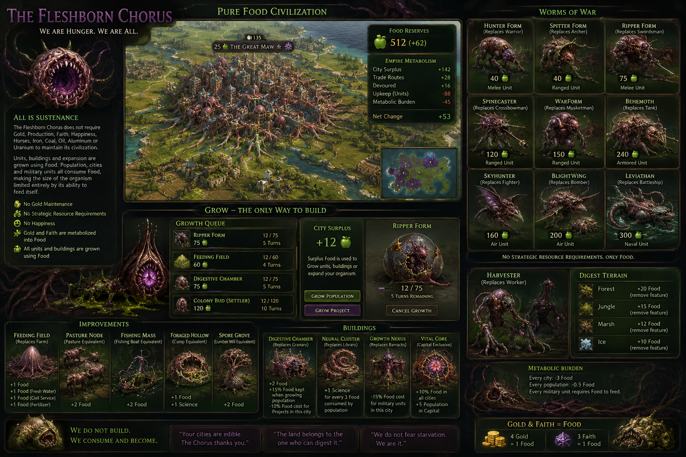

# The Fleshborn Chorus

> Gold? Production? Iron? Oil? Happiness? What are those? I require calories.

A playable Civilization V: Brave New World civilization for the Community Patch, led by **the First Maw**.

The Fleshborn Chorus is a deliberately extreme pure-Food civilization. Food is population, construction, expansion, and military supply. Science and Culture still advance technologies and policies, but almost every decision that would normally ask for Production, Gold, Faith, Happiness, or strategic resources returns to the same question:

**Can the organism feed itself?**

## At a glance

- **Civilization:** The Fleshborn Chorus
- **Leader:** The First Maw
- **Unique Ability:** All Is Sustenance
- **Unique Unit:** Devourer Form (Swordsman)
- **Unique Unit:** Harvester (Worker)
- **Unique Building:** Digestive Chamber (Granary)
- **Unique Building:** Neural Cluster (Library)
- **Unique Improvement:** Feeding Field (Farm)
- **Primary victories:** Domination or Science
- **Required mod:** Community Patch
- **Graphics:** Custom civilization, leader, interface, and presentation art; stock 3D unit and Farm models
- **Dawn of Man audio:** None—intentionally silent

## All Is Sustenance

The Chorus cannot spend normal Production and cannot construct World Wonders. Every Brood Node has an invisible `-100% Production` metabolic state plus a dynamic sink that cancels its whole raw hammer yield; the Food ledger restores only its own exact saved progress, so fractional engine Production and positive modifiers cannot reopen the economy. Mines, quarries, workshops, chops, and other sources of hammers cannot advance a Fleshborn order.

Instead, choose what the city should grow:

| Growth choice | Food cost | Result |
| --- | ---: | --- |
| **Grow Population** | Normal city growth | All usable Food remains in the growth store |
| **Unit** | 100% of its normal Production cost | Food becomes unit progress; population growth freezes |
| **Building / Project** | 125% of its normal Production cost | Food becomes project progress; population growth freezes |
| **Colony Bud** | 120% of Settler cost | Also removes 1 Population when completed |
| **World Congress project** | 1 Food per contribution | Food is staged as isolated Congress overflow; population growth freezes |

The production list is the Growth Queue. Select the explicit **Grow Population** process when a city should grow Citizens. Select a unit or building when its surplus should be diverted into a project. The normal CityView still uses hammer-shaped widgets in this placeholder release; the **Chorus metabolism button** near the top-right of the main screen shows the actual Food allocation and estimated Food cost.

The **Digestive Chamber** reduces every unit, building, and normal project’s Food cost by 10% in its city. Congress contributions remain a direct 1:1 conversion.

The **Neural Cluster** replaces the Library. Instead of the Community Patch Library's ordinary population-scaling yield, it generates **+1 Science for every 3 Food consumed by population** in its city. This counts ordinary Citizen consumption, the Chorus's additional Citizen metabolism, and additional Specialist metabolism, but not the fixed 3-Food city-organ burden.

Population growth is stopped at the population-change callback while any project is selected, and the pre-turn Food store is restored immediately. Unit, building, and project completion also requires a short-lived authorization written by the Food ledger. This closes normal hammers, feature chops, Great Engineer hurry, purchases, and other direct-Production completion paths rather than repairing their effects a turn later.

### What “surplus Food” means

The system begins with the city’s normal Food difference, then subtracts biological burdens:

```text
Usable Food = normal Food surplus
            - city metabolism
            - citizen metabolism
            - specialist metabolism
            - allocated army feeding
```

If a human-controlled city grows a project, its stored population-growth Food is frozen. It resumes from that amount when **Grow Population** is selected again. Project progress is stored per order, so switching between organisms does not let normal Production leak into either one.

## Metabolic Burden

Happiness does not limit the Chorus. Food does.

Every city consumes:

- **3 Food per turn** for the Brood Node itself;
- **0.5 Food per Citizen**, rounded up per city;
- **1 additional Food per Specialist**.

The **Founding Core** in the current capital contributes +4 Food. The Chorus also begins with a Harvester, allowing the First Stomach to create its first Feeding Field instead of becoming trapped by metabolism before any agricultural infrastructure exists. This safeguard belongs only to the current capital; every additional Brood Node pays the complete expansion burden.

The trait removes ordinary city and population unhappiness plus military and improvement maintenance. A hidden Community Patch dummy policy zeros universal unit upkeep—including civilian and air units—and supplies the purchase gates. Lua clamps the treasury’s real base building maintenance to zero at load, construction, capture, turn processing, and end turn, with the same policy providing a -100% building fallback. The policy is excluded from policy count, score, policy cost, and ideology checks. The DLL clamps unit upkeep and base building maintenance at zero, so no nominal Gold refund or negative-maintenance income is created. Occupied cities are treated as organs, not discontented populations.

This makes wide expansion expensive in the same currency used for everything else. A new Brood Node is a mouth before it is a stomach.

## Military feeding and The Hunger

Every military unit adds to an empire-wide feeding requirement based on the era of its prerequisite technology:

| Era | Food per military unit |
| --- | ---: |
| Ancient | 0.5 |
| Classical | 0.5 |
| Medieval | 1 |
| Renaissance | 1 |
| Industrial | 1.5 |
| Modern | 2 |
| Atomic / Postmodern | 2.5 |
| Information / Future | 3 |

Fractional costs are summed empire-wide and rounded once. Available post-metabolism surplus feeds the army before it can grow population or projects.

If the empire cannot meet the requirement, military units gain **The Hunger**. Each 10% band of unmet feeding applies:

- **-3% Combat Strength**, up to -30%;
- progressively reduced healing;
- at tier 7 or higher, no new military organisms can be grown.

Units are not automatically killed. A starving Chorus becomes weak rather than entering an unavoidable deletion spiral.

This creates the intended counterplay: pillage Feeding Fields, Plantations, Fishing Boats, and Food trade routes. An army that cannot be defeated head-on can still be starved.

## No strategic resources

Horses, Iron, Coal, Oil, Aluminum, and Uranium are inedible map objects. The Chorus does not need them.

At database load, the mod finds every default unit and building in the active BNW/Community Patch roster that consumes a strategic resource and creates a civ-specific biological copy without that requirement. Copies retain the active rules and stock 3D models. Unit copies keep their combat statistics, AI roles, promotions, prerequisites, and upgrade path. Named organisms use the custom supplied portrait atlas. Common unit copies receive biological names such as:

- Hunter Beast;
- Ripper Form;
- Behemoth;
- Skyhunter;
- Blightwing;
- Leviathan;
- Apex Warform;
- Star Womb and Void Heart.

This dynamic roster also handles Community Patch changes and spaceship components without granting fake strategic resources to the player. Resource-consuming infrastructure receives biological equivalents as well: Factory becomes **Industrial Stomach**, Hydro Plant becomes **Current Organ**, Nuclear Plant becomes **Fission Cyst**, and Spaceship Factory becomes **Ascension Womb**. Captured or gifted cities normalize base versions into the Chorus replacement before resource consumption is evaluated.

Captured units use the Community Patch capture-type hook to become the Chorus replacement for their unit class. Gifted and pre-existing foreign units are normalized on the next metabolic update, preserving their state through the DLL conversion routine. Captured Workers therefore become Harvesters, while captured strategic units cannot leave a hidden Iron, Oil, or Aluminum dependency behind. Conventional Gold upgrades are disabled: later organisms must be grown through Food.

## Gold, Faith, and religion

Gold and Faith cannot become secondary economies.

- Every **4 Gold** becomes **1 stored Food**.
- Every **3 Faith** becomes **1 stored Food**.
- Converted Food is spread as evenly as possible across all Brood Nodes.
- Unconverted remainders stay in the treasury until another complete conversion is possible.
- The Chorus cannot found a Pantheon or Religion.
- Gold/Faith unit and building purchases, automatic Faith purchases, Gold unit upgrades, and Gold tile purchases are disabled.

Trade deals, foreign trade routes, city-state rewards, and Great Merchant Gold are therefore not completely worthless, but they are badly inefficient beside agriculture. Science and Culture remain normal progression outputs.

Internal Production and internal Gold routes are unavailable; the Chorus can send Food internally. International routes remain available, with any Gold they return entering normal digestion.

## City-states, policies, and ideologies

The normal diplomatic and progression systems remain playable, but they cannot reopen the suppressed currencies:

- Gold gifts, Gold-funded city-state tile improvements, and diplomatic-marriage/buyout actions are unavailable because the Chorus cannot spend Gold. Unit gifts, quests, influence, spies, elections, bullying, alliances, and the diplomatic victory remain available.
- Gold or Faith received from first contact, tribute, quests, alliances, policies, tenets, or events enters normal digestion. Production rewards are discarded by the Production sink and cannot authorize a queue completion.
- Militaristic city-state gifts and tribute units are normalized to the Chorus unit-class replacement immediately, then add their normal army feeding requirement.
- Maritime Food and other direct Food rewards remain useful. Direct Science and Culture rewards remain normal progression outputs.
- All policy trees and ideologies remain available. The hidden invariant policy is a Community Patch dummy and does not count toward policy cost, score, branch completion, or ideology eligibility.
- Policy and ideology modifiers to Production, Gold, Faith, maintenance, strategic resources, or purchases cannot bypass the Food ledger. Direct Food, Science, Culture, Population, free-unit, and free-building effects remain legitimate progression rewards; anything they add is subject to metabolism on later turns.
- Factory-count ideology gates recognize the Chorus's Industrial Stomach because it is the civilization's Factory-class replacement.

Human puppets use the automated city allocation rather than the manual all-or-nothing growth rule. They spend only a share of usable Food on their autonomous order and may grow from the remainder. Annexed cities return to the normal manual choice. Peaceful transfers, conquest, and liberation also clear or initialize hidden metabolic state for the new owner, preventing foreign cities from retaining Chorus yield modifiers.

### Consuming conquered cities

Razing is **Consumption** for the Fleshborn Chorus. Every city currently being razed generates **5 Food per turn** for as long as the razing lasts. The harvest is routed to the nearest non-razing Brood Node, where it enters the normal current-turn metabolism budget and can feed the army, grow population, or advance the selected project.

The consumed city never receives its own harvest. This prevents Food growth from restoring its Population and extending the razing timer. Stopping the raze immediately stops the harvest; save/load, city transfer, and final city destruction do not award an extra payment. If no surviving non-razing Brood Node exists, no harvest is generated.

One narrow compatibility exception is intentional: policy or tenet effects that explicitly turn Happiness into Science or Culture remain progression bonuses. Happiness still cannot constrain expansion, fund an order, purchase anything, pay upkeep, or provide its normal passive Golden Age progress.

## Ancient Ruins

Ancient Ruins cannot open a second economy or bypass the growth queue. The Community Patch reward-choice hook automatically removes these results from the Chorus's eligible reward pool and rerolls the ruin:

- free Population, which would otherwise bypass Food growth or conflict with a frozen project city;
- a free Settler/Colony Bud, which would bypass both its Food cost and parent Population sacrifice;
- direct Production from compatible ruin mods or alternate Community Patch configurations.

Gold and Faith ruins remain available and enter normal digestion. Culture, Technology, exploration, healing, experience, promotions, and information rewards work normally. The Settler-difficulty Worker reward resolves to a Harvester. Ruin unit upgrades also remain available: the Community Patch selects the Chorus unit-class override before converting the unit, so strategic-resource classes become their biological replacement immediately and then enter normal army feeding.

## Unique components

### Feeding Field

Replaces the Farm through a Fleshborn-only Harvester action. The map uses Civ V's proven stock agricultural landmark internally, while Chorus Lua treats it entirely as a Feeding Field. This guarantees the completed, pillaged, resource, era, and Strategic View graphics without requiring a custom GR2 or FXSXML model. Earlier attempts using both cloned and direct stock art tags were valid in the database but were ignored by Civ V's landmark renderer.

- +1 Food base;
- +1 Food with Fresh Water;
- +1 Food at Civil Service;
- +1 Food at Fertilizer;
- a **worked** Feeding Field with at least three adjacent Feeding Fields gains +1 Food, capped at +1;
- may be constructed while preserving Marsh;
- Sugar, Bananas, and Citrus worked under a Plantation provide +2 additional Food to the city.

The Harvester button, Civilopedia, and completed map tooltip all call it **Feeding Field** and use the custom portrait where Civ V permits one. A context-sensitive UI layer changes only Chorus-owned agricultural plots; other civilizations continue to see their ordinary Farms. Fresh Water, universal technology scaling, and adjacency differences are applied through a hidden city Food counter, so they are included in city output even though the stock tile tooltip cannot display those custom yield lines.

### Digestive Chamber

Replaces the Granary.

- retains the active Community Patch Granary’s Food effects;
- has no maintenance;
- keeps an additional 15% Food after population growth;
- reduces Food spent per point of unit, building, or project progress by 10%.

### Neural Cluster

Replaces the Library and uses its stock portrait as placeholder art.

- has no maintenance;
- removes the Community Patch Library's ordinary +0.5 Science per Citizen;
- generates +1 Science for every complete 3 Food consumed by population in the city;
- counts normal 2-Food Citizen consumption, additional Fleshborn Citizen metabolism, and Specialist metabolism;
- does not count the fixed 3-Food Brood Node burden.

The bonus is recalculated dynamically. For example, a 3-Population city without Specialists consumes 8 Food for its population and receives +2 Science from its Neural Cluster.

Libraries acquired by the Chorus are normalized into Neural Clusters. If a city containing a Neural Cluster passes to a non-Chorus owner through conquest, liberation, or peaceful transfer, it becomes that civilization's normal Library-class building because the new owner does not possess Fleshborn population metabolism.

### Devourer Form

Replaces the Swordsman with the same base combat profile and no Iron requirement.

When a military unit dies with a Fleshborn Devourer adjacent to it, the nearest Brood Node receives Food equal to 25% of the victim’s Combat or Ranged Combat Strength. The reward is queued safely for the next metabolic update.

### Harvester

Replaces the Worker, and one Harvester accompanies the initial Colony Bud. It builds Feeding Fields, Roads, and other normal non-Farm improvements.

Its digestion actions remove a feature and feed the nearest city:

- Forest: **20 Food**;
- Jungle: **15 Food**;
- Marsh: **12 Food**.

Unlike a normal forest chop, this never creates Production.

### Colony Bud

Replaces the Settler.

- costs about 120% of normal Settler cost in Food;
- cannot be grown by a size-1 city;
- removes 1 Population from its parent when completed;
- founds a normal mechanically functional city presented as a Brood Node.

## Custom artwork and player colors

The supplied artwork is integrated through native Civ V DDS texture atlases:

- the framed Fleshborn maw is the full-color civilization icon, while a transparent white maw silhouette is used for the civilization alpha/map symbol;
- the First Maw has a dedicated leader portrait and static diplomacy scene;
- the illustrated world map is used by the civilization map panel;
- the Civ V-style landscape is the 1024×768 Dawn of Man image;
- Hunter Form, Spitter Form, Ripper/Devourer Form, Spinecaster, Warform, Behemoth, Skyhunter, Blightwing, Leviathan, Harvester, Colony Bud, Digestive Chamber, Feeding Field, and The Hunger use their matching portraits;
- Colony Bud v2 is the active Colony Bud portrait; v1 remains preserved with the source artwork;
- the concept infographic and alternate leader/Dawn of Man images remain in `Art/Source` for documentation and future presentation work.

Hunter Form, Spitter Form, Spinecaster, and Warform are civilization-specific copies of Warrior, Archer, Crossbowman, and Musketman. They inherit the active Community Patch statistics, AI roles, upgrade paths, sounds, and stock 3D models; the copies exist so their Fleshborn names and portraits can appear without altering those units for every civilization.

The in-game color identity is now **deep Chorus purple** as the primary/player territory color and **acidic bone-gold** as the secondary emblem and unit-flag color. These colors affect borders, city banners, unit flags, score/diplomacy identifiers, and strategic-map presentation.



## Culture, Golden Ages, and AI

Each Brood Node receives **+1 Culture**, plus another +1 Culture per five Population, representing collective instinct and inherited memory. Normal population Science remains the foundation of technology, while a Neural Cluster converts the Food consumed by that population into additional Science.

Golden Ages function as **Blooming Cycles** and give every Brood Node +10% Food. This release keeps the stock Golden Age label outside the metabolism panel.

### Reading the metabolism panel

The top-right Food button opens the authoritative current-turn budget. At a glance it shows Food remaining after projects and the empire condition: **Fed**, **Balanced**, **Fully Committed**, **Strained**, or **Hungry**. During an army deficit it instead prioritizes the Hunger tier and exact Combat Strength penalty. Its tooltip summarizes remaining Food and army coverage without opening the ledger.

The panel reads from left to right:

- **Food Entering** combines Base Surplus—the sum of Civ V city Food differences after ordinary citizen consumption—with Food injected by digestion, Devourer kills, and similar queued rewards. The capital's Founding Core is already included.
- **Fixed Costs** combines city/citizen metabolism with the portion of military feeding actually supplied.
- **Projects** is Food diverted into units, buildings, normal projects, and Congress contributions during the snapshot.
- **Free Food** is the remainder after project allocation. In population-growth cities it remains in the growth store; near-complete or stalled project cities may leave some temporarily uncommitted.

The army section reports Food supplied versus required, percentage coverage, Hunger tier, and the exact current combat penalty. The Brood Node ledger marks each city as **Fed**, **Fully Committed**, **No Free Food**, or **Deficit**; shows its local Food flow; names its current growth mode; and estimates turns to population growth or project completion at the latest allocation rate.

Because city metabolism is local, a deficient Brood Node cannot contribute negative Food that cancels another city's surplus. The panel therefore totals each city's usable Food after its local clamp, reports strained cities separately, and then subtracts project spending. Static tooltips on each summary card explain exactly what is included.

Luxury Happiness remains visible in the stock interface, but its normal per-turn contribution to the Golden Age meter is removed. Golden Age points from policies, wonders, and Great People still work, so Blooming Cycles remain possible without turning luxuries into a second managed economy.

The Golden Age filter uses a one-turn meter reservation instead of subtracting from the aggregate meter after the fact. The next Happiness tick pays back that reservation, while unrelated meter gains remain intact and Happiness cannot silently push the meter over its threshold first.

The explicit growth process and active World Congress processes are the only processes available to the Chorus. World’s Fair, International Games, and International Space Station contributions consume Food and reach the normal League system, so their rewards and rankings remain compatible with Community Patch behavior. Congress conversion carries fractional hundredth-hammer credit or debt between turns, preserving the 1:1 rate over time without allowing rounding residue to become a second economy.

Human players make a hard city-by-city choice between population and projects. AI players use an automated approximation of the design targets:

- about 40% of usable Food goes to a selected project at peace;
- about 60% goes to Colony Buds;
- about 70% goes to military projects during war;
- severe Hunger disables military growth.

The remainder stays available for AI population growth, preventing the normal AI production chooser from accidentally freezing every city forever.

## Installation

### Build and deploy with ModBuddy

1. Install the Civilization V SDK and the **Community Patch** for Civilization V: Brave New World.
2. Open `TheFleshbornChorus.civ5sln` in ModBuddy (or open `TheFleshbornChorus.civ5proj` directly).
3. In the project properties, verify **Civilization V Path** and **Civilization V User Path** if the game or Documents folder is not in the default location recorded by the project.
4. Choose **Build > Build Solution** to generate the mod, or **Build > Deploy Solution** to copy it into Civilization V's `MODS` directory.
5. Start Civilization V, open **MODS**, and enable the Community Patch and **The Fleshborn Chorus** before beginning a new game.

ModBuddy writes the generated manifest and deployable files under the sibling `Build\The Fleshborn Chorus` directory. The checked-in `The Fleshborn Chorus (v 1).modinfo` remains a standalone source-tree manifest for manual installs; ModBuddy regenerates its own equivalent manifest when the project builds.

### Manual source-tree install

1. Install and enable the **Community Patch** for Civilization V: Brave New World. It is a hard manifest dependency; the Chorus will not load ahead of or without it.
2. Copy this repository folder into:

   ```text
   Documents\My Games\Sid Meier's Civilization 5\MODS\The Fleshborn Chorus (v 1)
   ```

3. Start Civilization V, open **MODS**, enable the Community Patch and **The Fleshborn Chorus**, then begin a new game.
4. Do not add the mod to an existing save; it changes database definitions and save data.

The mod is designed for single-player. Multiplayer and Hot Seat are disabled in the manifest because the growth ledger and UI have not yet been network-synchronization tested.

## Presentation

The release combines the supplied 2D artwork with stock Civilization V world assets:

- custom civilization, leader, unit, building, improvement, promotion, map, Dawn of Man, and diplomacy textures;
- custom deep-purple and bone-gold player colors;
- stock 3D unit models and animations beneath the custom biological portraits;
- stock Farm landmark models for Feeding Fields, beneath the custom Feeding Field interface icon.

No custom audio is installed, audio reload is disabled, and the civilization’s `DawnOfManAudio` value is explicitly empty. The Dawn of Man screen is silent by design.

## Repository layout

```text
The Fleshborn Chorus (v 1).modinfo  Mod manifest and hard CP dependency
TheFleshbornChorus.civ5sln          ModBuddy solution
TheFleshbornChorus.civ5proj         ModBuddy project; build or deploy this file
SQL/00_Fleshborn_Core.sql           Civilization, units, buildings, improvement, promotions
SQL/10_Fleshborn_Text.sql           English text and Civilopedia entries
Lua/FleshbornCore.lua               Food economy and Community Patch event systems
UI/FleshbornStatusPanel.xml         In-game metabolism panel layout
UI/FleshbornStatusPanel.lua         Panel data and interaction
Art/Atlases                         Generated Civ V DDS icon atlases
Art/Screens                         Dawn of Man, map, and diplomacy DDS textures
Art/Source                          Supplied full-resolution PNG source artwork
Art/Fleshborn_LeaderScene.xml       Static First Maw diplomacy scene
Tools/build_art.py                  Reproducible PNG-to-DDS atlas builder
PATCH_NOTES.md                      Release history, known limitations, and next work
```

See [PATCH_NOTES.md](PATCH_NOTES.md) for the exact version 1 implementation scope and remaining 3D-model/UI limitations.
